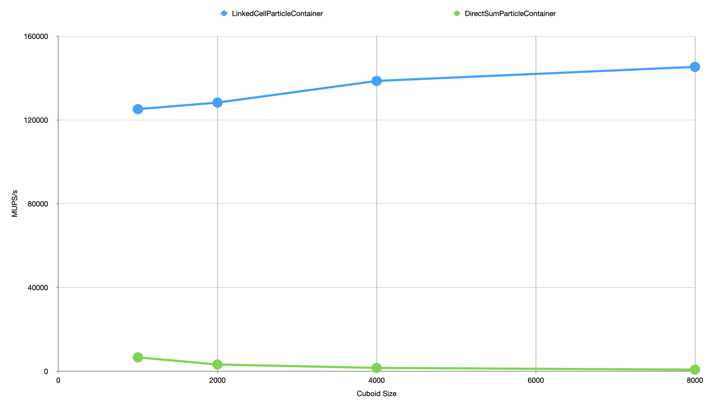

MolSim PSEMolDyn_GroupG
=======================

Code for the practical course *PSE: Molecular Dynamics* by group G.

Members: <br />
Alexandra Marquardt <br />
Matteo Wohlrapp <br />
Michael Borisov <br />
Group Id: G

Link to the repository: https://github.com/SecTedd/PSEMolDyn_GroupG <br />
Branch: assignment2 <br />
Commit Id: # <br />


Video: <br />
The two cuboids colide. In the beginning you can see the particles moving aroung a little bit, this is caused by the brownian motion and works as expected. <br />
Watch video at 60 times speed or so. 

## Build and run: 

### Build without Doxygen
1. Navigate into the build folder: `cd build` 
2. Run `cmake ..` to create the makefile. We use gcc 11.2.0 as compiler.
3. Run `make` to generate the executable and tests.

### Build with Doxygen
1. Navigate into the build folder: `cd build`
2. Run `cmake -D BUILD_DOC=ON ..` to create the makefile. We use gcc 11.2.0 as the compiler.
3. Run `make` to generate the executable and tests and `make doc_doxygen` to generate the documentation. 

### Run 
After building the project you can run the executable 
1. Navigate into the build folder: `cd build` 
2. The application can be run from the console (but only with one input file). Run `./MolSim -h` to print the help text. <br />
The -f option automatically distinguishes between old input files and new cuboid files. <br />
3. The application also allows you to enter a interactive menu where you can read in multiple files, start the simulation multiple times, etc. Run `./MolSim -m` to enter the menu, a help message is shown. <br />
The -f option automatically distinguishes between old input files and new cuboid files. <br />
4. The generated files can be found at ~/build/outputXXX where **XXX** is the output type, e.g. VTK or XYZ.
5. **Warning** the contents of the output folders will be overwritten in every run of the simulation!

### Run tests
1. Navigate into the build folder: `cd build`
2. Run `ctest` to execute all unit tests.
3. The result of the unit tests are printed to the console.

## Logging: 
For logging we use spdlog. The logs are written to files which can be found in the **/logs/** folder. The logs are separated into logic and memory logs. Logic logs are used to log events in the program flow. Within the logic logs, there is the distinction between input, output and simulation. Memory logs on the other hand document the construction and destruction of objects and therefore help to detect and prevent memory leaks.




## Structure: 
```
./
├── build
├── cmake
│   └── modules
│       ├── doxygen.cmake
│       ├── googletest.cmake
│       └── spdlog.cmake
├── CMakeLists.txt
├── Doxyfile
├── input
│   ├── eingabe-cuboid1.txt
│   ├── eingabe-cuboid2.txt
│   └── eingabe-sonne.txt
├── libs
├── logs
│   ├── input.txt
│   ├── memory.text
│   ├── output.txt
│   └── simulation.txt
├── README.md
├── src
│   ├── ConsoleMenu.cpp
│   ├── ConsoleMenu.h
│   ├── inputReader
│   │   ├── CuboidInputReader.cpp
│   │   ├── CuboidInputReader.h
│   │   ├── FileReader.cpp
│   │   ├── FileReader.h
│   │   ├── InputFacade.cpp
│   │   ├── InputFacade.h
│   │   ├── InputReader.cpp
│   │   └── InputReader.h
│   ├── model
│   │   ├── Cuboid.cpp
│   │   ├── Cuboid.h
│   │   ├── ParticleContainer.cpp
│   │   ├── ParticleContainer.h
│   │   ├── Particle.cpp
│   │   ├── Particle.h
│   │   ├── ProgramParameters.cpp
│   │   └── ProgramParameters.h
│   ├── MolSim.cpp
│   ├── outputWriter
│   │   ├── OutputFacade.cpp
│   │   ├── OutputFacade.h
│   │   ├── vtk-unstructured.cpp
│   │   ├── vtk-unstructured.h
│   │   ├── vtk-unstructured.xsd
│   │   ├── VTKWriter.cpp
│   │   ├── VTKWriter.h
│   │   ├── XYZWriter.cpp
│   │   └── XYZWriter.h
│   ├── simulation
│   │   ├── ForceCalculation.cpp
│   │   ├── ForceCalculation.h
│   │   ├── GravitationalForce.cpp
│   │   ├── GravitationalForce.h
│   │   ├── LennardJonesForce.cpp
│   │   ├── LennardJonesForce.h
│   │   ├── Simulation.cpp
│   │   └── Simulation.h
│   └── utils
│       ├── ArrayUtils.h
│       ├── Input.h
│       └── MaxwellBoltzmannDistribution.h
└── tests
    ├── CuboidInputReader_test.cc
    ├── eingabe-cuboid.txt
    ├── LennardJonesForce_test.cc
    ├── main.cc
    └── ParticleContainer_test.cc
```