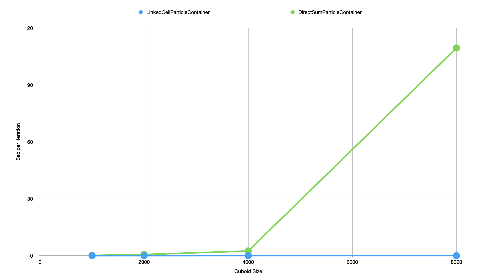

# MolSim PSEMolDyn_GroupG

Code for the practical course *PSE: Molecular Dynamics* by group G.

Members: <br />
Alexandra Marquardt <br />
Matteo Wohlrapp <br />
Michael Borisov <br />
Group Id: G

Link to the repository: https://github.com/SecTedd/PSEMolDyn_GroupG <br />
Branch: assignment3 <br />
Commit Id: # <br />

Video: <br />

1. Video
   CuboidCollide.avi is almost the same video as for last week, but with more particles and the use of the new Linked Cell Algorithm. <br />
   The Linked Cell Algorithm makes it possible to have many more particles and still a reasonable runtime. <br />
   For Details about performance and the implementation please review the slides. <br />
   <br />
2. Video
   FallingDrop.avi shows our falling drop simulation. Here you can see how a sphere, representing our water drop, falls onto an invisible boundary and splashes around. <br />
   Gravity is not implemented yet, thats why the water drop goes back up in the end of the video. <br />

## Build and run

### Build without Doxygen

1. Navigate into the build folder: `cd build`
2. Run `cmake ..` to create the makefile. We use gcc 11.2.0 as compiler.
3. Run `make` to generate the executable and tests.

### Build with Doxygen

1. Navigate into the build folder: `cd build`
2. Run `cmake -D BUILD_DOC=ON ..` to create the makefile. We use gcc 11.2.0 as the compiler.
3. Run `make` to generate the executable and tests and `make doc_doxygen` to generate the documentation.

### Run

After building the project you can run the executable

1. Familiarize yourself with the provided .xml file located in the /input/ folder and the .xsd file located in the /xsd/ folder. <br />
   XML-Files are used to specify different parameters. <br />
2. Create a new XML-File or use the provided one and specify all the input parameters that are needed. <br />
3. Navigate into the build folder: `cd build`
4. The application can be run from the console. Run `./MolSim -h` to print the help text. <br />
   The -f option automatically distinguishes between different input files, such as xml, cuboid, sphere etc. <br />
5. The application also allows you to enter an interactive menu where you can read in multiple files, start the simulation multiple times, etc. Run `./MolSim -m` to enter the menu, a help message is shown. <br />
   The -f option automatically distinguishes between different input files, such as xml, cuboid, sphere etc. <br />
6. The generated VTK-Files can be found at the path you specified in the xml. <br />
7. **Warning** the contents of the output folders will be overwritten if you run the simulation multiple times with the same output folder path! <br />

### Run tests

1. Navigate into the build folder: `cd build`
2. Run `ctest` to execute all unit tests.
3. The result of the unit tests are printed to the console.

## Logging

For logging we use spdlog. <br />
The logs are written to files which can be found in the **/logs/** folder or to the console (see `./MolSim -h`). The logs are separated into logic and memory logs. <br />
Logic logs are used to log events in the program flow. Within the logic logs, there is the distinction between input, output and simulation. <br />
Memory logs on the other hand document the construction and destruction of objects and therefore help to detect and prevent memory leaks. <br />

## Plots



## Structure: 
```
./
├── build
├── cmake
│   └── modules
│       ├── doxygen.cmake
│       ├── googletest.cmake
│       └── spdlog.cmake
├── CMakeLists.txt
├── Doxyfile
├── input
│   ├── eingabe-cuboid1.txt
│   ├── eingabe-cuboid2.txt
│   └── eingabe-sonne.txt
├── libs
├── logs
│   ├── input.txt
│   ├── memory.text
│   ├── output.txt
│   └── simulation.txt
├── README.md
├── src
│   ├── ConsoleMenu.cpp
│   ├── ConsoleMenu.h
│   ├── inputReader
│   │   ├── CuboidInputReader.cpp
│   │   ├── CuboidInputReader.h
│   │   ├── FileReader.cpp
│   │   ├── FileReader.h
│   │   ├── InputFacade.cpp
│   │   ├── InputFacade.h
│   │   ├── InputReader.cpp
│   │   └── InputReader.h
│   ├── model
│   │   ├── Cuboid.cpp
│   │   ├── Cuboid.h
│   │   ├── ParticleContainer.cpp
│   │   ├── ParticleContainer.h
│   │   ├── Particle.cpp
│   │   ├── Particle.h
│   │   ├── ProgramParameters.cpp
│   │   └── ProgramParameters.h
│   ├── MolSim.cpp
│   ├── outputWriter
│   │   ├── OutputFacade.cpp
│   │   ├── OutputFacade.h
│   │   ├── vtk-unstructured.cpp
│   │   ├── vtk-unstructured.h
│   │   ├── vtk-unstructured.xsd
│   │   ├── VTKWriter.cpp
│   │   ├── VTKWriter.h
│   │   ├── XYZWriter.cpp
│   │   └── XYZWriter.h
│   ├── simulation
│   │   ├── ForceCalculation.cpp
│   │   ├── ForceCalculation.h
│   │   ├── GravitationalForce.cpp
│   │   ├── GravitationalForce.h
│   │   ├── LennardJonesForce.cpp
│   │   ├── LennardJonesForce.h
│   │   ├── Simulation.cpp
│   │   └── Simulation.h
│   └── utils
│       ├── ArrayUtils.h
│       ├── Input.h
│       └── MaxwellBoltzmannDistribution.h
└── tests
    ├── CuboidInputReader_test.cc
    ├── eingabe-cuboid.txt
    ├── LennardJonesForce_test.cc
    ├── main.cc
    └── ParticleContainer_test.cc
```
