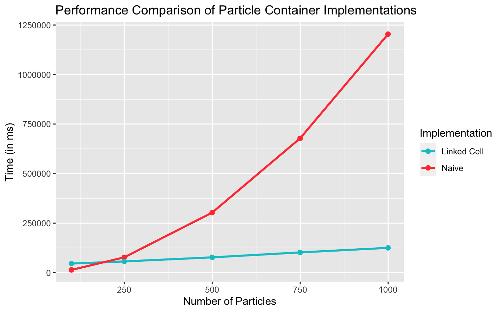

# PSE Molecular Dynamics WS23/24 - Group F

## Members
- Alp Kaan Aksu
- Berke Saylan
- Feryal Ezgi Aşkın

## Code
- Link:     https://github.com/alpkaanaksu/MolSim

**Works with:**
- **Compiler:** clang 15.0.0
- CMake 3.27.7
- GNU Make 3.81

*Other compilers / versions would probably also work but we only tested with these.*


## Compiling and running the program

- You need `xerces-c` and `boost` (`program_options` and `filesystem`) to compile the program.

```bash
mkdir build # if it does not exist
cd build
```

```bash
ccmake ..
```

*CMake will automatically fetch some files needed for additional libraries like `googletest`, `spdlog` and `nlohmann_json`*

```bash
make
```

```bash
./MolSim ../input/cuboids.json
```


The last line starts the program to run the simulation specified in `input/cuboids.json` with the parameters defined in the JSON file.

---

`./MolSim --help` shows you all possible CLI arguments.

### Doxygen

```bash
make doc_doxygen
```

An online version of the documentation can be found [here](https://alpkaanaksu.github.io/MolSim/).

### Naive Particle Container vs Linked Cell Particle Container
