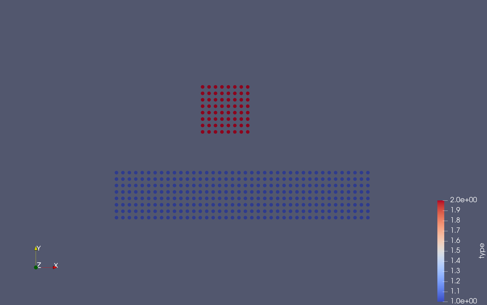

# PSE Molecular Dynamics WS23/24 - Group F

## Members
- Alp Kaan Aksu
- Berke Saylan
- Feryal Ezgi Aşkın

## Code
- Link:     https://github.com/alpkaanaksu/MolSim
- Branch:   master
- Revision: *TODO*

**Works with:**
- **Compiler:** clang 15.0.0
- CMake 3.27.7
- GNU Make 3.81

*Other compilers / versions would probably also work but we only tested with these.*


## Compiling and running the program

- You need `xerces-c` and `boost` (`program_options` and `filesystem`) to compile the program.

```bash
mkdir build # if it does not exist
cd build
```

```bash
ccmake ..
```

*CMake will automatically fetch some files needed for additional libraries like `googletest`, `spdlog` and `nlohmann_json`*

```bash
make
```

```bash
./MolSim ../input/cuboids.json
```


The last line starts the program to run the simulation specified in `input/cuboids.json` with the parameters defined in the JSON file.

---

## Unit Testing 
We are using GoogleTest framework for the unit tests in this project, since our project is expected to be independent of the user system’s available libraries, we achieve self-containment by incorporating the necessary GoogleTest content directly into our project using the `FetchContent_Declare` function. The current latest GoogleTest version we are working with is v1.14.0, which we are fetching from this GitHub commit: https://github.com/google/googletest/archive/refs/tags/v1.14.0.zip. For the unit tests we are creating a new test executable named `MolSimTest`, which contains all the files with unit tests, apart from the main executable `MolSim`. We then used `gtest_discover_tests` to automatically discover and configure tests for `MolSimTest`. 

We incorporated test fixtures as they help isolate tests from each other and ensure a clean and consistent starting point for each test. We also defined setup and teardown procedures, some of which include generating random particles and adding them to the ParticleContainer. This fuzz testing approach can be handy in the future for identifying potential issues or vulnerabilities in our implementation, contributing to its overall resilience and robustness.

In our testing procedures, we employed the `ASSERT` macro during the setup and teardown stages to interrupt execution when critical conditions weren't met. For actual testing scenarios, we utilized the `EXPECT` macro, which allowed us to continue execution and gather detailed information about any encountered failures.

We ensured clear documentation by including meaningful comments. Additionally, we implemented logging mechanisms to track and monitor the execution of tests effectively.


All tests can be run using the `ctest` command.

## Continuous Integration 
In order to utilize continuous integration in the development cycle of our project, we use two GitHub Actions workflows that streamline both the development and documentation processes. The CMake workflow ensures consistent builds using different compilers (GCC, Clang) by configuring and building the project with CMake, considering platform-specific requirements and compiler settings (address sanitizer is activated). With this workflow, we ensure that our Molecular Dynamics simulation has the basic software engineering qualities such as compiler independence and a standardised build process, regardless of the user's system settings. This workflow also runs the tests we created.

We also use the GitHub Pages Deployment Workflow, which automates the deployment of Doxygen-generated documentation to GitHub Pages. This workflow generates Doxygen documentation, uploads it as an artifact and deploys it to GitHub Pages, providing accessible and up-to-date project documentation. You can visit the documentation page at https://alpkaanaksu.github.io/MolSim/.

## Logging 
We again use the FetchContent module to acquire the `spdlog` library from its GitHub repository, ensuring our project's independence from user system libraries. The current latest `spdlog` library version we are working with is v1.12.0, which we are downloading from this GitHub commit:  https://github.com/gabime/spdlog.git. `spdlog` is linked to both the main executable (`MolSim`) and the test executable (`MolSimTest`), so that we can use efficient logging capabilities in tests as well. We opted for using spdlog functions instead of macros in our simulation. This decision is due to the greater flexibility offered by the features that allow dynamic customisation of logging details such as message format and logging level. Although we have not currently utilised these customisation options, we foresee their importance for future enhancements to the simulation. The ability to dynamically customise logging might be critical for more complex functions, and we consider the slight execution overhead that the features introduce to be acceptable, given the benefits they may provide for our future logging requirements.

## Improvements in Input File Processing 
We decided to switch from a `.txt` file to a `.json` file to specify simulation input parameters such as the video duration, the selected force calculation model, the width of the molecular cuboid, etc. First of all, using a `.json` file helps us to better structure our input file and parameters, which also makes parsing the input file much easier. JSON files are also human-readable, which simplifies the creation and inspection of simulation files. Currently, there are many important input parameters in the simulation and it is likely that there will be even more complex parameters in the future. Therefore, the flexibility of JSON in representing different types of information and using different data structures helps with the hierarchical structure and readability, maintainability of the input file processing module. The `JSONReader::readFile` method uses the `nlohmann::json ` library to parse a given JSON file and return the parsed JSON object. JSON files encapsulate everything needed for a simulation neatly in a single file.

In the `Simulation` constructor, we used this JSON object to initialize various simulation parameters. The values for parameters such as `endTime`, `deltaT`, `videoDuration`, `fps`, `out`, and `outputType` are directly extracted from the `simulation` section of the JSON file. Additionally, particle configurations specified under the `objects ` key are added to the simulation using the particle container. The choice of simulation model is determined based on the `model ` key, allowing for dynamic selection between different models such as the basic one or Lennard-Jones model with specific parameters like epsilon and sigma.

Running the simulation in `input/eingabe-sonne.txt` now requires the use of the `--legacy-file` flag, since the default input file type is now JSON: 

```
./MolSim ../input/eingabe-sonne.txt --legacy-file
```

Alternatively, you can use the new JSON file `input/halleys_comet.json`, which is just a translation of the old input file to JSON. The simulation results are identical for both input files.

## Updates in Particle Simulation
### Particle Generator 
Instead of generating molecules one by one separately, we make use of a particle generator functions (they are all in the `Generator` namespace), which orchestrates the creation of a cuboid where particles are arranged in a 3D rectangular grid. Essential parameters such as position, size, mesh width, initial velocity, mass, and type ID define the characteristics of the cuboid. In this iteration of the project, we simulate the collision of two cuboids of different sizes.



The `type_id` parameter (in the JSON file) allows us to visualize the cuboids in different colors.

### Brownian Motion 
Particles are in continuous motion driven by their thermal energy, a form of kinetic energy known as Brownian motion. This inherent randomness results in unpredictable fluctuations in particle direction and speed, however this randomness can be characterized and represented by specific probability distributions such as Maxwell Boltzmann distribution. In our simulation, we apply Brownian motion to the particles only once at the beginning of the simulation and not at each time step. In the `Simulation::run` method, we initialise the velocity of the particles with the sum of the entered velocity parameters for this cuboid and the velocity caused by Brownian motion, which is calculated using the Maxwell-Boltzmann distribution in the header with the same name.


The image shows the velocity of the particles. It is clear that the particles are moving in random directions and with different speeds.

### Lennard Jones Model
The Lennard Jones mathematical model is commonly used in molecular dynamics simulations to calculate the potential energies, hence forces between atoms or molecules. The model accounts for both attractive van der Waals forces at longer distances and repulsive forces at shorter distances, providing a realistic approximation of intermolecular interactions. We created a new model in our Model class. 

## Time Measurement
We used the following command (on a 2022 MacBook Air with M2, running macOS Sonoma 14.0) to time the simulation:

```bash
time ./MolSim ../input/cuboids_time.json --log off
```

The `--log off` argument is used to disable logging, since it would slow down the simulation. `cuboids_time.json` is identical to `cuboids.json` except for the output type, which is disabled in `cuboids_time.json`. We got the following results:

```
36.70s user 0.17s system 99% cpu 37.141 total
```

Which means that the simulation took 37.141 seconds to run. We also tried to run the simulation with default logging (where spdlog is set to *info*), which enables logging and file outputs. We got the following results:

```
42.30s user 0.37s system 98% cpu 43.251 total
```

So logging and writing files slows down the simulation by about 6 seconds. This still includes the initial reading of the input file, so this is not a completely accurate / isolated measurement. But this gives us a rough idea about the performance until we implement better and more accurate ways to time the program.

## Miscellaneous Improvements

We addressed all the feedback we got from Markus for the first sheet and implemented the following improvements.

### Class Descriptions
- We added descriptions for all classes and methods in the header files.
- There is still room for improvement. We will continue to improve the descriptions in the next sheets.

### 3rd Law of Newton
- We implemented a new function called `applyToAllPairsOnce(f)`. It applies the function to all **unique** pairs. This way, we can avoid applying the function to the same pair twice. This function is used in the `Simulation::run` method to calculate the forces between particles. (This was also a part of this worksheet.)

### Model Class
- It works, but we agree that it unnecessarily complicates the code. We will simplify it in the next sheets.

### Output Type as String
- The output type (VTK or XYZ) is now displayed as a human-readable string in the program output (simulation overview).

### Avoid copying of ParticleContainer
- We simplified the constructor, it now uses the existing particle container. That means, we don't create an unnecessary ParticleContainer.

### Improving the Loop (Running the Simulation)
- We now calculate the forces before going into the loop.
- We declare all needed functions (force, velocity, position) before entering the loop, since they are unlikely to change during the simulation.

### Creating the output folder automatically
- We now create the output folder automatically if it does not exist. If it does exists, we remove the old one and write the new files.
- The new `prepareOutputFolder` function in the `outputWriter` namespace (implemented in `src/io/outputWriter/Writer.cpp`) is used in the `Simulation::run` method to handle this.
