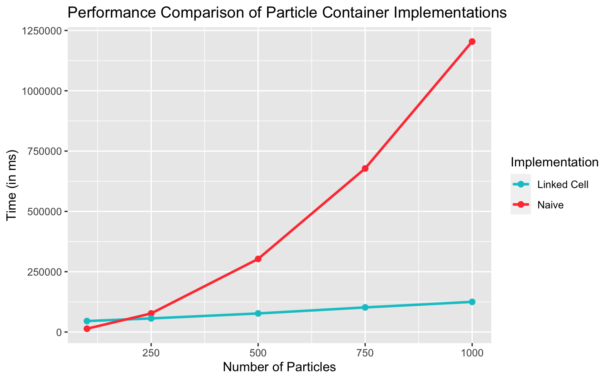

# PSE Molecular Dynamics WS23/24 - Group F

## Members
- Alp Kaan Aksu
- Berke Saylan
- Feryal Ezgi Aşkın

## Code
- Link:     https://github.com/alpkaanaksu/MolSim
- Branch:   master
- Revision: 35d61c5dfe2e5e20d47b182a88764ed6029b2ffc

**Works with:**
- **Compiler:** clang 15.0.0
- CMake 3.27.7
- GNU Make 3.81

*Other compilers / versions would probably also work but we only tested with these.*


## Compiling and running the program
- You need `xerces-c` and `boost` (`program_options` and `filesystem`) to compile the program.

```bash
mkdir build # if it does not exist
cd build
```

```bash
ccmake ..
```

*CMake will automatically fetch some files needed for additional libraries like `googletest`, `spdlog` and `nlohmann_json`*

```bash
make
```

```bash
./MolSim ../input/sphere.json
```


The last line starts the program to run the simulation specified in `input/sphere.json` with the parameters defined in the JSON file. It is the simulation of a drop falling against a reflective boundary, it uses our new LinkedCellParticleContainer.

---

`./MolSim --help` shows you all possible CLI arguments.

### Doxygen

```bash
make doc_doxygen
```

An online version of the documentation can be found [here](https://alpkaanaksu.github.io/MolSim/).

## Simulation Description in JSON
(*See sheet 2 report for more details on how we implemented this.*)

We decided to continue using JSON for our input files since we already had a working implementation.

### Structure of Input Files
The general structure remains the same: the object has a `simulation` and an `objects` field. `simulation` includes all meta information about the simulation, including information about the particle container. `objects` includes all objects that are part of the simulation, currently, objects can be single particles, cuboids, spheres or disks. For cuboids, spheres and disks, corresponding functions from the `Generator` namespace, e.g. `Generator::disk`, are used to add multiple particles to the container.

Setting the output interval is currently only indirectly possible by setting the `video_duration` and `frame_rate` fields in the `simulation` object. Allowing direct input of the output interval would be trivial, but we wanted to **keep our program opinionated** in this regard: We only use the output files for visualizing our particles in ParaView, specifying the output interval would be an indirect way of influencing the duration and frame rate of the video. We let the user have **meaningful control** over the output, **without any guesswork** (i.e. 'What is the optimal interval for my ParaView configuration? Let's try some.'). But you can still let us know if you think it is crucial to be able to set the plot interval. We also see being able to change the output folder as a better alternative to changing the base file name, so we also decided to go with it.

### Describing a Particle Container

The `particle_container` field of the `simulation` includes all relevant information to build a particle container. `dimensions` determine the size of the domain, `cutoff_radius` is pretty self-explanatory.

The `boundary` field is more interesting, it can be used to set boundary conditions for the container. It is possible to specify a different value for each side (we call the sides `top`, `bottom`, `left`, `right`, `front`, `back`). You can also use the `all` shorthand if you want all boundaries to behave the same.

Inspired by CSS, more specific 'selectors' override less specific ones. For example, if you set `all` to `reflective` and `right` to `outflow`, the right boundary will be `outflow` and all other boundaries will be `reflective`.

```
"particle_container": {
  "type": "linked_cell",
  "dimensions": [120, 50, 3],
  "cutoff_radius": 3,
  "boundary": {
    "all": "reflective",
    "right": "outflow"
  }
},
```

## Linked-Cell Algorithm
### About Linked-Cell Container
We are managing all cells (including inner, boundary and halo cells) in the Linked Cell Particle Container with a vector of vector of Particles named cells. The user input for the dimension sizes of the container may differ for different dimensions, therefore we are setting the cell size differently for different dimensions. Since the Linked Cell algorithm works the best, when the cell size in every dimension is as close as possible to the cut-off radius but is equal or bigger. In order to achieve this we divide the size of every dimension through the cut-off radius and then round it down and set it as the effective cell number (inner and boundary cells) in the respective dimension. Then we divide the size of the respective dimension through the number of effective cells and round it down, thus in the end cell size in every dimension should be equal or bigger than the cut-off radius. Since cells vector also includes halo cells, we increase the cells number by 2 in every dimension (+1 on each sides). Finally in the constructor we precompute the indices of boundary and halo cells in the cells vector and create 2 sets for them, so that in the future we have the utility to only iterate through the halo or boundary cells. With the current status while iterating through the cells vector in the methods, we have to check if the index of a cell is in halo cells indices set. To reduce this overhead we created a new vector of bools, the indices of this vector is mapped 1:1 to the indices in the cells vector and the true value indicates that the cell is not halo, whereas false value indicates it is halo cell.

### Index-Position Conversions
The function `index3dTo1d` is designed to convert three-dimensional coordinates (x, y, z) to a one-dimensional index. The coordinates represent the lowest, frontmost, and leftmost point of a linked cell, with examples being (0, 0, 0) for the first non-halo cell and `{0 – cellXSize, 0 – cellYSize, 0 – cellZSize}` for the first halo cell. Let $P$ be the set of points inside a cell, defined as $\{(x, y, z) | (x, y, z) ∈ P and x = min(Px), y = min(Py), z = min(Pz)\}$. These points are then mapped to the index of the cell within the cells vector using the formula `index = x + y * xCells + z * xCells * yCells`. The rationale behind this formula lies in the fact that `z * xCells * yCells` represents the contribution from the z-coordinate, scaled by both the number of cells in the x-direction and the number of cells in the y-direction. This ensures that the z-coordinate contributes to a distinct "block" of the one-dimensional array for each layer in the z-direction.

Conversely, the `index1dTo3d` method serves as the inverse function for `index3dTo1d`, aiming to map a linear index to its corresponding position in a three-dimensional space, where each dimension represents a different axis (x, y, and z). The mathematical operations involved in this method essentially reverse the operations performed in `index3dTo1d`.

The function `cellIndexForParticle` is designed to determine the appropriate cell for a particle based on its position. This involves breaking down the particle's position in each dimension by the size of the corresponding cell in that dimension. The addition of 1 to the result in every dimension is incorporated to ensure that the calculation aligns with indexing conventions. This adjustment is necessary as the 0 cell index in every dimension is reserved for halo cells in the cells vector. Subsequently, a computation analogous to the one used in `index3dTo1d` is applied, determining the overall index of the cell within the cells vector where the particle is intended to reside.

### Cell Iteration to Apply Functions
The method `applyToAllPairsOnce` iterates through each cell, skipping halo cells, and subsequently examines all unique pairs of particles within the same cell. Following this, the algorithm now also checks for neighboring cells in a 3D space (26 neighboring cells), skipping the central cell. For each neighboring cell, it examines all pairs of particles involving particles from the current cell and the neighboring cell, once again avoiding duplicate computations through memory address comparisons. A smart way to reduce the overhead caused by neighboring cell iterations for each cell would of course be doing the neighboring cell iteration only in the positive direction, so that duplicate application of the function on the same pair between neighboring cells is inherently avoided. In the current status of our simulation a possible edge case we are overseeing prevents this working from properly. However, if possible we will try to apply this idea in future iterations. 

There are two functions in play here: the first one, called `applyToAll`, updates the velocity of particles, while the second one handles position updates. The second function also checks whether the new position of a particle falls into a different cell; if it does, the cell of the particle is updated accordingly.

## Boundary Conditions
Now, when it comes to reflecting particles off boundaries, we're using a different approach than the suggested one. We've implemented a function called vectorReverseReflection, which relies on other helper methods. Its main purpose is to ensure that particles don't exit the simulation boundaries, especially when those boundaries are set to be reflective.

Here's how it works: the function checks if the new position of a particle is outside the simulation boundaries. If it is, the function calculates how far the particle has traveled beyond the boundary in the last iteration. It then allows the particle to move up to the boundary and reflects the remaining distance in the opposite direction. This ensures that the particle "bounces back" into the simulation.

Additionally, the function reverses the dimension component in the particle's velocity that corresponds to the boundary it reached. For example, if the particle was moving towards the maximum X value (e.g., maxX = 5), and its current position suggests x = 7, the function sets the new x position to be x = 3 and negates the x component of the particle's velocity.

Importantly, this reflection process occurs before updating the cell for the particle. This ensures that particles remain within the simulation boundaries and aren't sent to a halo cell if reflection is enabled at that boundary.

## Performance Comparison
We compared our old ParticleContainer implementation with the new one (LinkedCellParticleContainer). We used 100, 250, 500, 750 and 1000 particles for the comparison, because running the simulation with 8000 particles etc. and the pattern was already clear. (We read on Matrix that this is the important thing for this task.)

Having the run with 100 particles also helps us to see the overhead of the LinkedCellParticleContainer. Managing cells takes time and the naive implementation is faster if there are only a few particles.

According to our results, the time needed for the simulation grows linearly with the number of particles, while the naive implementation displays an exponential growth in needed time.



We also embedded this plot into the Doxygen documentation of LinkedCellParticleContainer: [Online documentation | LinkedCellParticleContainer](https://alpkaanaksu.github.io/MolSim/classLinkedCellParticleContainer.html)

## Comments on the videos

### cuboids_linkedcell.mp4
The simulation from the last week, this time in a LinkedCellParticleContainer with limited domain size. The behavior is almost exactly the same to the one from last worksheet, except for particles disappearing on reaching the boundaries. This is the simulation we used for the performance comparison.

### boundaries.mp4
This is a simulation, where all boundaries except the right one is reflective. We have two 5x5 cuboids going in opposite directions (left and right). The cuboid on the right side disappears (outflow) while the particles of the left cuboid are reflected. They even go out from the right boundary at the end! This clearly shows the behavior of our boundaries and how you can have different behaviors for different boundaries.

### drop.mp4

This is the simulation for the last task.

## Misc
- We changed the output before starting the simulation, now we also display boundary conditions for each side.