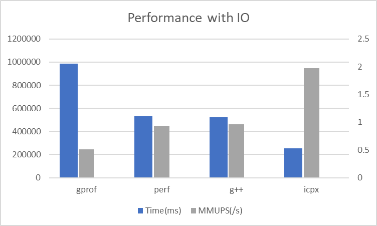
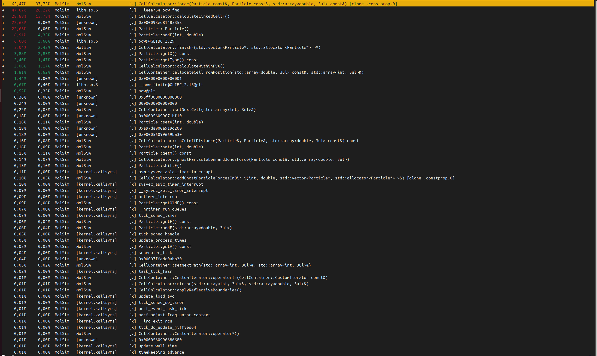
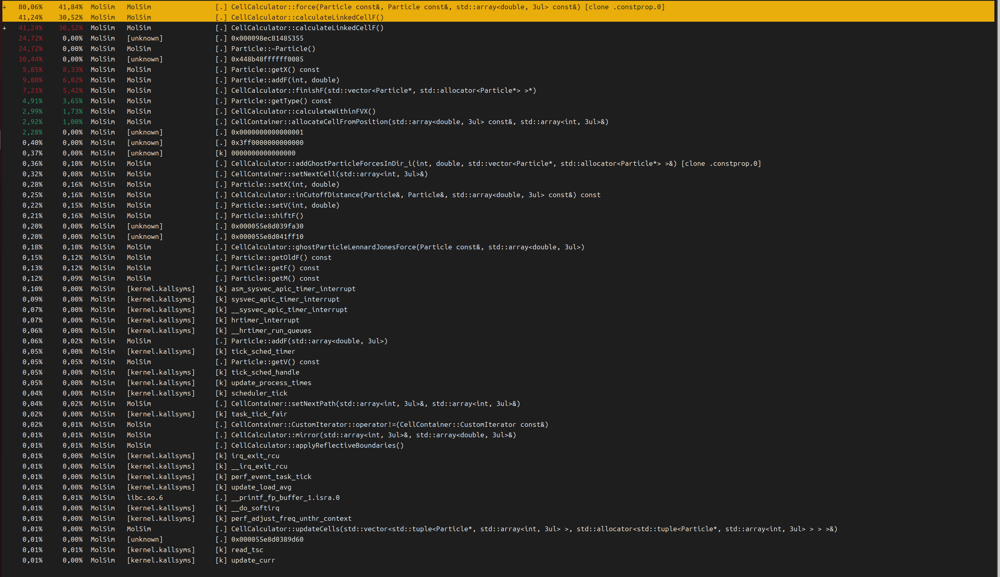

# Group B
## Project Information

**Members:**
Yuchen Zhao


**Build/Usage:**
```
mkdir build && cd build
ccmake ..

#for executable
make

#for usage type -h or no arguments, yields:
Usage ./MolSim [-l<String>] [-p] [-o] -f<String>
 Info:              See the /input folder for the parameters.xsd schema, in which 
                    program arguments should be specified
 -f<String>:        gives the filename of an .xml file, that has to follow
                    the xsd schema defined in input/parameters.xsd.
                    from this file all programm arguments / options will be read(see README)
 -l<String>:        specifies the level of logging, e.g. how fine grained programm logs are.
                    can either be "off" "trace", "debug", "info", "error" or "critical".
                    The default level is "debug".
 -h                 prints a help message
 -p                 if the flag is set, the programm will measure the time for the execution.
                    therefore no vtk output and no logging will happen (specifing a log level at
                    the same time is undefined behaviour)

#for documentation
make doc_doxygen 
```

**Notes:**
We did this assignment separately. For Task 1-3, please refer to [Project Part 123](https://github.com/Grazvy/PSEMolDyn_GroupB).
For Task 4-5, please refer to [Project Part 45](https://github.com/NanaYCZ/MolSim/). The main work is shown in branch "yuchen", while the attempt of performance improvement is shown in branch "performence_enhancement_pow612".

## Report
### Task 1 Thermostats

### Task 2 Simulation of the Rayleigh-Taylor instability

### Task 3 Simulation of a falling drop - Liquid

### Task 4 Performance Measurement and profiling

First, runtime measurement was implemented in the Simulation.cpp. The system time before and after the iterations can be recorded using std::chrono: methods. And by recording the iteration counts, particle counts in the containers and runtime, MUPS/s can be calculated. By adjusting whether or not to switch on the performance_measurement option in main.cpp, one can get the runtime with (PM=OFF) or without (PM=ON) the I/O.
Because of some issues with 2FA, Linux Cluster was not able to connected to. So for both with and without I/O, performance has been measured locally on Ubuntu 23.10 x86_64 system with CPU AMD Ryzen 7 7735HS. G++ and icpx are used in the compiling, and profiling is done with perf and gprof. The executables are created with follows:
for g++:
```
cmake -DCMAKE_CXX_COMPILER=g++ ..
```
for icpx:
```
source /opt/intel/oneapi/setvars.sh
cmake -DCMAKE_CXX_COMPILER=icpx ..
```
for perf, to activate the perf report we need to run the program with
```
perf record -g ./MolSim -f[filename in xml format]
```
and then to read the report on terminal run
```
perf report
```
or to generate the report run
```
perf report > [filename]
```
for gprof, create the executable with
```
cmake -DCMAKE_CXX_COMPILER=g++ -DCMAKE_CXX_FLAGS=-pg -DCMAKE_EXE_LINKER_FLAGS=-pg -DCMAKE_SHARED_LINKER_FLAGS=-pg ..
```
and after run the program, generate the report with
```
gprof MolSim > [filename]
```
All of these measurements are done with
```
BUILD_TEST                       OFF
BUILD_TESTING                    OFF
DOXY_DOC                         OFF
CMAKE_BUILD_TYPE                 Release
```
so that all other functions are turned off and compiler optimizations are enabled as build type release activates -O3 for intel and g++.
The runtime and million molecular updates per seconds are recorded in the table below.

| WithIO| Time(ms) | MMUPS(/s) |
|----------|----------|----------|
| gprof | 986509 | 0.506848 |
| perf | 532505 | 0.938977 |
| g++ | 521936 | 0.957991 |
| icpx | 253297 | 1.97401 |



| WithoutIO | Time(ms) | MMUPS(/s) |
|-----------|----------|----------|
| gprof     | 952947 | 0.524699 |
| perf      | 477388 | 1.04739 |
| g++       | 477116 | 1.04798 |
| icpx      | 234348 | 2.13362 |


We can find out that without the writing part the program indeed speeds up. Both gprof and perf are used in conjunction with the g++ compiler, and we can see that pure g++ is indeed faster than gprof and perf, as it lacks the profiling step. It is noteworthy that the time difference between perf and g++ is negligible, but gprof is significantly slower than both. Gprof introduces extra performance overhead and may alter the behavior of the program. However, perf utilizes performance monitoring features provided by processors and operating systems, resulting in minimal interference with the analyzed program and lower performance overhead. Thus using perf is a wiser choice for the later profiling. Additionally, the speed of compilation with icpx is much faster than with g++, which may be due to its unique optimization strategies.
We take a deep look into the profile to find out which part of the program takes the main usage of time.



From the perf report we can find out that force calculation especially calling the power function within the force calculation takes most of the time consumption.
In the gprof report we get the same result, although gprof does not show the performance of external functions being called.
```
Flat profile:
Each sample counts as 0.01 seconds.
%   cumulative   self              self     total           
time   seconds   seconds    calls   s/call   s/call  name    
46.19    196.51   196.51 5673059275     0.00     0.00  CellCalculator::force(Particle const&, Particle const&, std::array<double, 3ul> const&) [clone .constprop.0]
26.58    309.59   113.08    50002     0.00     0.01  CellCalculator::calculateLinkedCellF()
11.40    358.09    48.50 8921847736     0.00     0.00  Particle::addF(int, double)
4.50    377.22    19.13 75598657     0.00     0.00  CellCalculator::finishF(std::vector<Particle*, std::allocator<Particle*> >*)
3.28    391.16    13.94 10831558411     0.00     0.00  Particle::getX() const
1.57    397.86     6.70    50001     0.00     0.00  CellCalculator::calculateWithinFVX()
1.48    404.15     6.29 5782025358     0.00     0.00  Particle::getType() const
1.22    409.34     5.19 500020107     0.00     0.00  CellContainer::allocateCellFromPosition(std::array<double, 3ul> const&, std::array<int, 3ul>&)
0.61    411.94     2.60                             _init
0.44    413.82     1.88 1500030107     0.00     0.00  Particle::setV(int, double)
0.36    415.37     1.55 1010540000     0.00     0.00  Particle::getM() const
0.34    416.83     1.46 1500060107     0.00     0.00  Particle::setX(int, double)
0.33    418.24     1.41    77001     0.00     0.00  xsd::cxx::xml::char_utf8_transcoder<char>::from(char const*, unsigned long)
0.31    419.54     1.30 500020000     0.00     0.00  Particle::shiftF()
0.29    420.77     1.23 110000000     0.00     0.00  std::__cxx11::basic_string<char, std::char_traits<char>, std::allocator<char> > xsd::cxx::tree::bits::insert<char>(xsd::cxx::tree::as_decimal<double> const&)
0.24    421.80     1.03 77163237     0.00     0.00  CellContainer::setNextCell(std::array<int, 3ul>&)
0.19    422.62     0.82 111291283     0.00     0.00  CellCalculator::inCutoffDistance(Particle&, Particle&, std::array<double, 3ul> const&) const
0.16    423.29     0.67  5000100     0.00     0.00  CellCalculator::addGhostParticleForcesInDir_i(int, double, std::vector<Particle*, std::allocator<Particle*> >&) [clone .constprop.0]
0.12    423.78     0.49 17387969     0.00     0.00  CellCalculator::ghostParticleLennardJonesForce(Particle const&, std::array<double, 3ul>)
0.09    424.16     0.38     6000     0.00     0.00  void xsd::cxx::tree::operator<< <char, double, true>(xsd::cxx::tree::list_stream<char>&, xsd::cxx::tree::list<double, char, (xsd::cxx::tree::schema_type::value)2, true> const&)
0.06    424.40     0.24 530010000     0.00     0.00  Particle::getOldF() const
0.05    424.63     0.23 10000000     0.00     0.00  outputWriter::VTKWriter::plotParticle(Particle&)
0.05    424.84     0.21 531020107     0.00     0.00  Particle::getV() const
0.04    425.00     0.16 17387969     0.00     0.00  Particle::addF(std::array<double, 3ul>)
0.03    425.14     0.14 500020000     0.00     0.00  Particle::getF() const
0.02    425.23     0.09 15000300     0.00     0.00  CellContainer::CustomIterator::operator*()
0.02    425.31     0.08    50001     0.00     0.00  CellCalculator::applyReflectiveBoundaries()
0.01    425.36     0.05       50     0.00     0.00  CellCalculator::applyThermostats()
0.01    425.40     0.04 17650706     0.00     0.00  CellContainer::setNextPath(std::array<int, 3ul>&, std::array<int, 3ul>&)
0.00    425.42     0.02 18388710     0.00     0.00  CellCalculator::mirror(std::array<int, 3ul>&, std::array<double, 3ul>&)
0.00    425.44     0.02 15000300     0.00     0.00  CellContainer::CustomIterator::operator++()
0.00    425.46     0.02                             xsd::cxx::xml::dom::ostream_format_target::writeChars(unsigned char const*, unsigned long, xercesc_3_2::XMLFormatter*)
0.00    425.47     0.01    50002     0.00     0.00  CellCalculator::updateCells(std::vector<std::tuple<Particle*, std::array<int, 3ul> >, std::allocator<std::tuple<Particle*, std::array<int, 3ul> > > >&)
...
```
Thus, in task 5 a replacement of power function is considered.

### Task 5 Tuning the sequential Performance
The calculation of Lennard-Jones potential is one of the most frequently called function located in the CellCalculator and contains pow(x,6) and pow(x,12). If the exponent is a fraction, it might be difficult to handle, but currently, the exponents are small integers, 6 and 12, and 12 is a multiple of 6. Therefore, it is easy to consider using arguments and multiplication to replace the call to the external function power.
By doing so, icpx, g++ and perf are again used to profile the performance.

| Replacement of pow() | Time(ms) | MMUPS(/s) |
|----------------------|----------|----------|
| icpx                 | 336686 | 1.48509 |
| perf                 | 347053 | 1.44073 |
| g++                  | 343870 | 1.45407 |

We can find out the result to be magical. Using Intel LLVM C++ Compiler the measurement slows down, however using g++ and g++ profiling the result speed up a lot. And now the difference between icpx and g++ becomes much smaller and more reasonable. This suggests that the previously excellent performance of Intel may exactly be due to extensive optimizations made when calling the pow function.
The profile of the new performance is shown as follows. We can see that now there is no function that takes the lead of the consumption, only structure issue is left.




