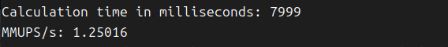
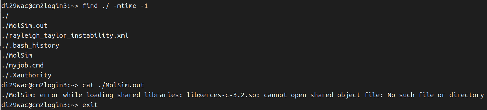
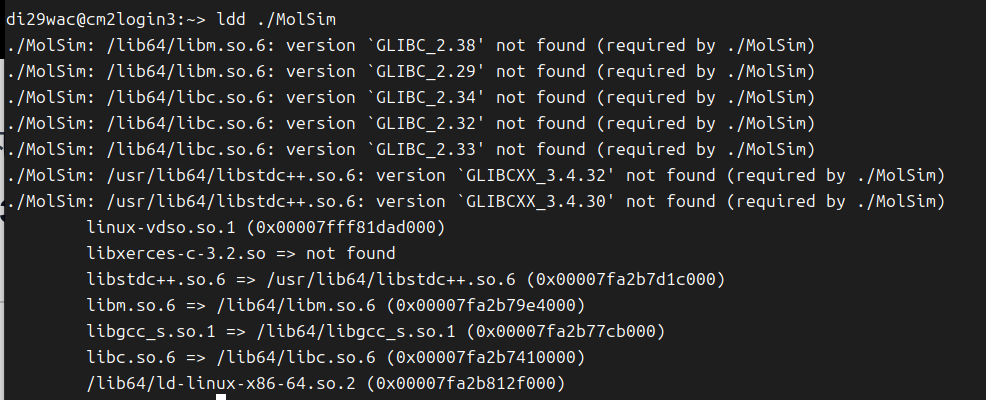
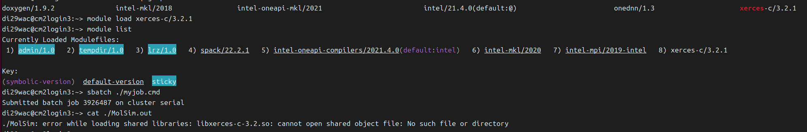
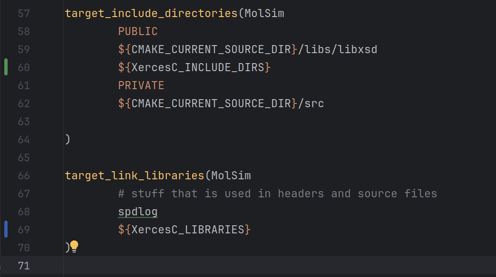
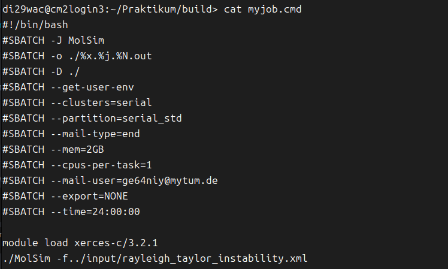

For the contest, aka running the rayleigh big experiment for first 1000 iterations, the result of our group is as follows:


Now I may introduce the whole process.
Besides the complicated login procedures, the biggest problem is the failure of linking the libxerces library and thus failed to read xml files in the cluster. 
At first, I built the program on local and loaded the executable, input file and file into the cluster. I got the error as follows:


After taking a deep look into the dependency of our executable, it turned  out that it could not find several related libraries used by the program. 


Finding out that I'm not the root user and don't have the right to import libraries into the cluster, I then tried to specify shared library search paths by adding ```export LD_LIBRARY_PATH=/path/to/local/x86_64-linux-gnu:$LD_LIBRARY_PATH ``` into the ```.bashrc``` of the cluster, trying to link the library from my local to the program running on cluster.
However, it failed to solve the problem. Then I found out that there are extra modules on the cluster that could be added and used, so by commands ```module list```, ```module avail``` and ```module load```, I searched and added the module ```xerces-c/3.2.1``` and checked the linked library again by command ```ldd program```. 


As the image below shows, all the related libraries should have been included, however, it still failed to run the executable. 

 
After that I realized that I should have built the project on cluster instead of local. I tried it again from the beginning, using ```scp /path/to/local/file <USER>@lxlogin<1234 89>.lrz.de: /path/to/cluster/directory``` to upload all the program and input files and built the program on the login node with ```xerces-c/3.2.1``` module added. 
In the CMakeFile of the program, I also added xerces-c into the linked library. 


. 
The slurm job in ```myjob.cmd``` is written as follows (also experienced quite a number of failures and changes): 


Using command ```sbatch myjob.cmd```, it finally succeeded in running the simulation on the compute nodes. In the output file ```MolSim.3929689.i23r06c03s09.out```, the result of our contest (changing the times of iteration limit to 1000) turned out to be 7999 milliseconds and 1.25016 MMUPS/s.
